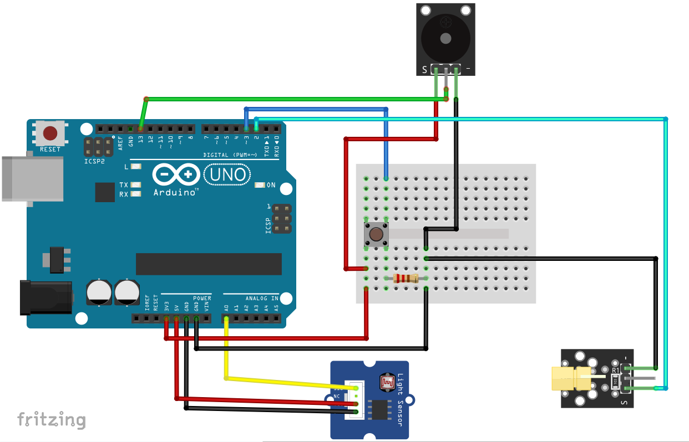
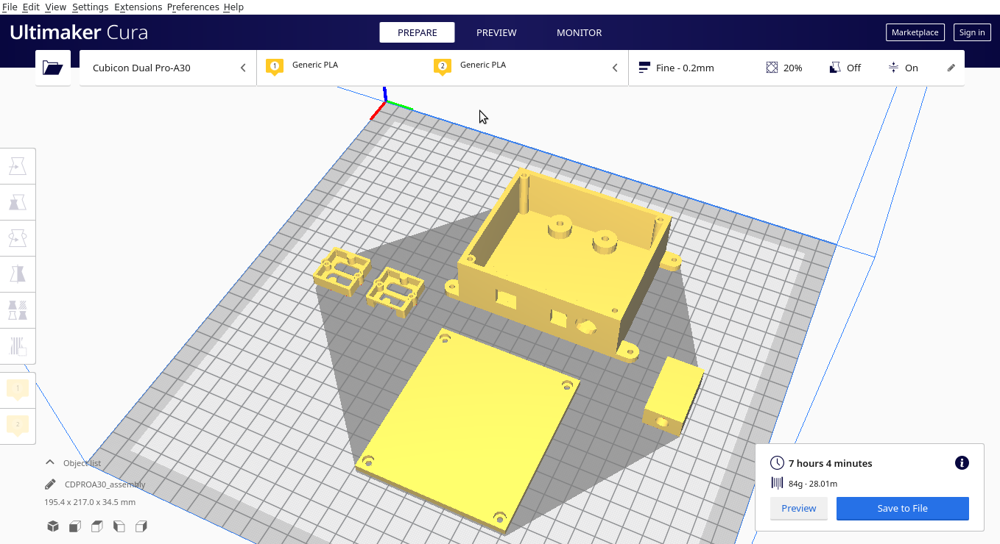
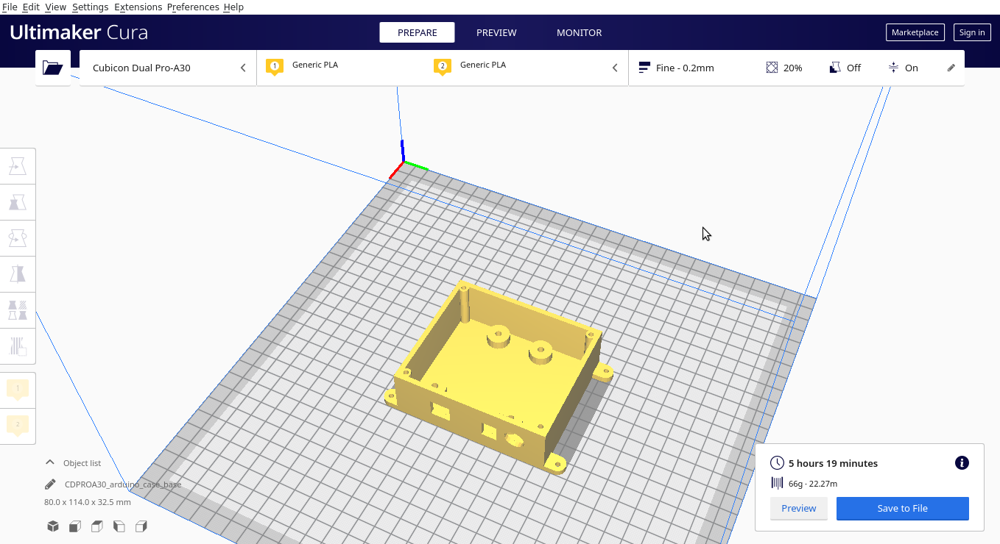
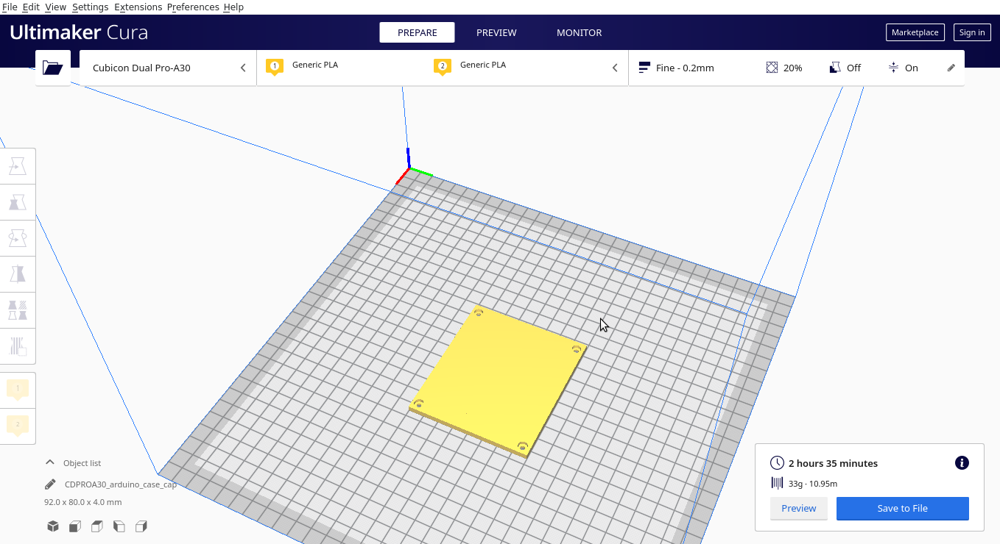
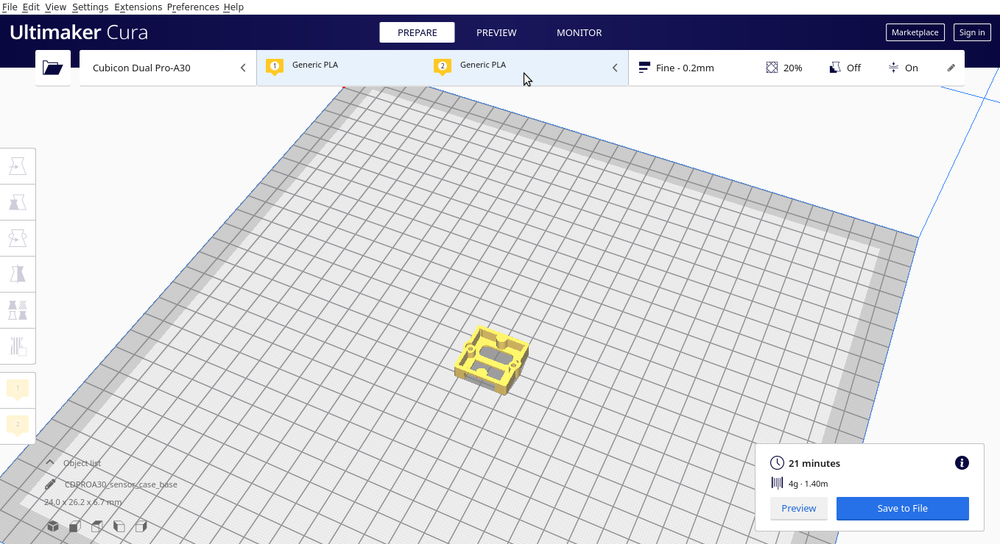
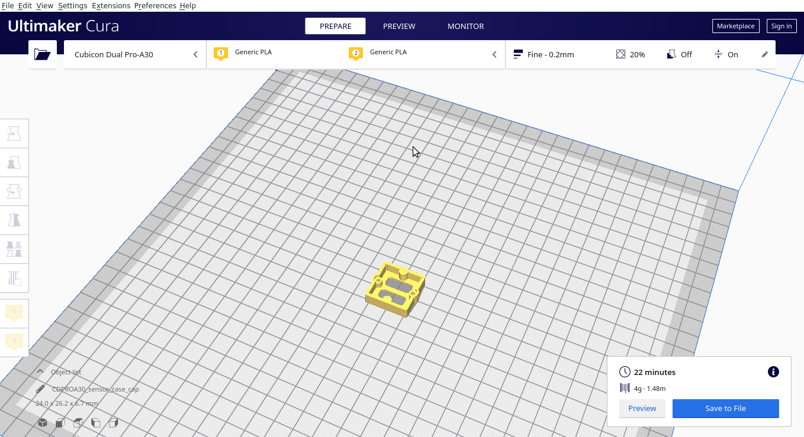
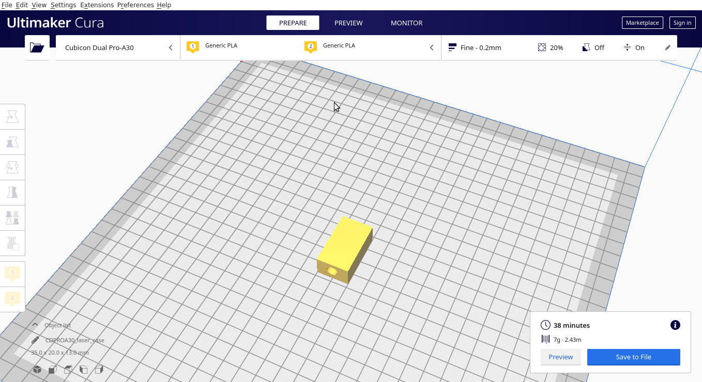

<p align="center">
    
</p>

<h2 align="center">Laser Alarm</h2>

<p align="center">
     Laser Alarm Security System Using Arduino
</p>

[](https://t.me/xruin)
[](https://github.com/xbaysal11/laser-alarm-arduino)
[](https://github.com/xbaysal11)
[](https://github.com/xbaysal11/laser-alarm-arduino)
[](https://t.me/xruin)

---

In this project I have designed Laser Security System Using Arduino wih Alarm with the application of Laser Module KY-008. The project idea revolves around creating a security system.

A tripwire is a device triggered by physical movements, you can use it to detect people, animals, cars... when they pass through an area. This one is based on a laser module, that constantly sends beams to the light sensor, and when someone/something passes, the sensor won't receive the beams, and the alarm is triggered, and won't stop until you resest it (push button).

This project is based on the module, laser module, a buzzer, and a push button, the idea is very simple, the laser is constantly projecting light to the module sensor, when a person or something passes through the light beam, the sensor will not detect the light anymore (When the light stops, the LDR will increase resistance, which means less current will pass, and we’ll get a voltage drop).

Example: At indoor light the sensor will give a value of around “750” when using the “analogRead” function while using Arduino it’s around “3.66V” (1023 for 5V), but when you cover the sensor it will show a value around “10-15” that stands for “40mV”. So it’s better to cover or put the sensor in a case where only the laser beams can reach.

Once the laser beams are cut, the alarm will go off and will not stop until the push button is pressed even though the module detects the laser again.

---

## Firmware

### For making this system we will use the following components / parts list:

1. Arduino UNO x 1
2. Seeed Grove - Light Sensor x 1
3. Laser Module KY-008 x 1
4. Buzzer x 1
5. Push Button x 1
6. Resistor 10kΩ x 1
7. Bread Board x 1
8. Jumper Wire x 10

### Circuit:



### Code:

Link to [Arduino code](Firmware/laser-alarm.ino).

```
#define Rec 0
#define Laser 2
#define Button 3

bool detection;

void setup() {
  pinMode(Laser, OUTPUT);
  digitalWrite(Laser, HIGH);
  delay(2000);
}

void loop() {

 short Detect = analogRead(Rec);
 bool  Button_state = digitalRead(Button);

 if(Detect < 500)
    detection = true;

 if(detection==true)
    {
       tone(13,2000);
       delay(50);
       tone(13,1000);
       delay(50);
    }

 if(Button_state == HIGH)
    {
      detection = false;
      noTone(13);
    }
}
```

---

## 3D Print

Link to [THINGIVERSE.COM - 3D printable files](https://www.thingiverse.com/thing:4295444/files).

### All drawings dimensions:

1. arduino_case_base
    - X = 80000 mm
    - Y = 114000 mm
    - Z = 32500 mm
2. arduino_case_cap
    - X = 92000 mm
    - Y = 80000 mm
    - Z = 4000 mm
3. laser_case
    - X = 35000 mm
    - Y = 20000 mm
    - Z = 13000 mm
4. sensor_case_base
    - X = 24000 mm
    - Y = 26200 mm
    - Z = 6700 mm
5. arduino_case_cap
    - X = 24000 mm
    - Y = 26200 mm
    - Z = 6700 mm

### Images








---

### AUTHOR

-   [Baisalbek Daniiarov](https://github.com/xbaysal11)

---

### SPONSORS [[Become a sponsor](https://t.me/xruin)]

[](https://t.me/xruin)

---

### LICENSE

Laser Alarm is [GPL-3.0 licensed.](https://github.com/xbaysal11/laser-alarm-arduino/blob/master/LICENSE)
